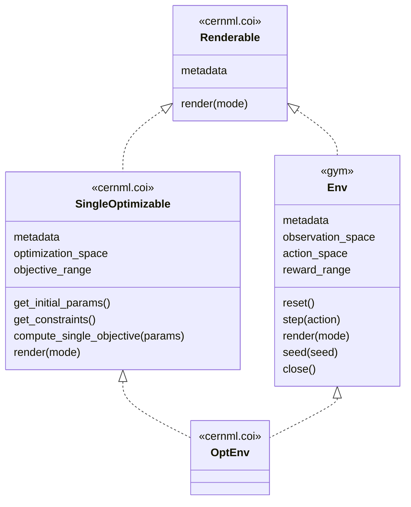
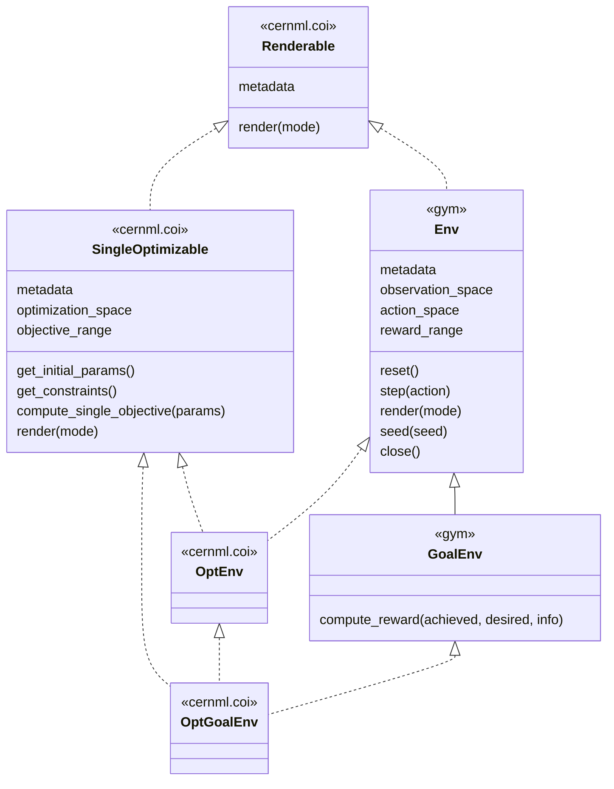
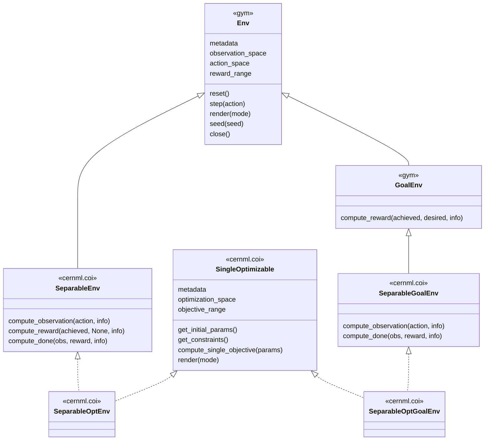

Common Optimization Interface that abstracts over optimizers and RL agents
==========================================================================

CERN ML is the project of bringing numerical optimization, machine learning and
reinforcement learning to the operation of the CERN accelerator complex.

CERNML-COI defines common interfaces that facilitate using numerical
optimization and reinforcement learning (RL) on the same optimization problems.
This makes it possible to unify both approaches into a generic optimization
application in the CERN Control Center.

This repository can be found online on CERN's [Gitlab][].

[Gitlab]: https://gitlab.cern.ch/be-op-ml-optimization/cernml-coi/

Table of Contents
-----------------

[[_TOC_]]

Motivation
----------

Several problems in accelerator control can be solved both using reinforcement
learning (RL) and numerical optimization. However, both approaches usually
slightly differ in their expected input and output:

- Num. optimizers pick certain _points_ in the phase space of modifiable
  parameters and evaluate the loss of these parameters. They minimize this loss
  through multiple evaluations and ultimately yield the optimal parameters.
- RL agents assume that the problem has a certain state, which usually contains
  the values of all modifiable parameters. They receive an observation (which
  is usually higher-dimensional than the loss) and calculate a _correction_ of
  the parameters. This correction yields a certain reward to them. Their goal
  is to optimize the parameters incrementally by optimzing their corrections
  for maximal reward.

More informally, num. optimizers start from scratch each time they are applied
and they yield a point in phase space. RL agents learn once, can be applied
many times, and they yield a sequence of deltas in the phase space.

Even more informally, on a given machine, a num. optimizer performs the
state transition `machine.parameters = new_parameters`, whereas an RL agent
performs the state transition `machine.parameters += corrections` iteratively.

This package provides interfaces to implement for problems that should be
compatible both with num. optimizers and RL agents. It is based on the [Gym][]
environment API and enhances it with the `Optimizable` interface. In addition,
the output and metadata of the environments is _restricted_ to make the
behavior of environments more uniform and compatible to make them more easily
visualizable and integrable into a generic machine-optimization application.

[Gym]: https://github.com/openai/gym/

The Core API
------------



The most important interface is `OptEnv`, which describes any environment that
is compatible both with RL and with num. optimization. This is done by
inheriting from two base interfaces: `gym.Env` for RL and `SingleOptimizable`
for num. optimization.

Both `gym.Env` and `SingleOptimizable` provide the same API to *render*
themselves:
- a method `render()` that may be called with a *render mode* that tells it
  whether to use pyplot, text, a pixel buffer, etc;
- a class attribute `metadata` that is a dictionary which maps `'render.modes'`
  to a list of supported render modes.

This package describes this API with an abstract base class `Renderable`.
Because it is an ABC, anything that fulfills the above requirements
automatically inherits from it.

`OptEnv` is an ABC as well. That means, any class that inherits from both
`SingleOptimizable` and from `gym.Env` also inherits from `OptEnv`. The class
exists mainly for simplicity and convenience.

Environment Registry
--------------------

This package provides an *environment registry* similar to the one provided by
`gym` itself. Every environment that wants to be usable in a generic context
should register itself to it. The usage is as follows:

```python
from cernml.coi import OptEnv, register

class MyEnv(OptEnv):
    ...

register('mypackage:MyEnv-v0', entry_point=MyEnv)
```

This makes your environment known to "the world" and an environment management
application that imports your package knows how to find and interact with your
environment.

GoalEnv
-------



The `gym` package provides `GoalEnv` as a specialization of `Env`. To
accommodate it, this package also provides `OptGoalEnv` as a similar abstract
base class for everything that inherits both from `SingleOptimizable` and from
`gym.GoalEnv`.

SeparableEnv
------------



Under certain circumstances, it is useful to define your environment in a
*separable* manner, i.e. to factor the calculation of reward and end-of-episode
out of the side-effectful calculation of the next observation. This is useful
to e.g. calculate a reward for the initial observation.

For this purpose, the `SeparableEnv` interface is provided. It implements
`Env.step()` by means of three new abstract methods: `compute_observation()`,
`compute_reward()` and `compute_done()`.

For compatibility with `OptEnv` and `GoalEnv`, further abstract classes are
also provided in a predictable manner.

Restrictions
------------

For maximum compatibility, this API puts the following *additional*
restrictions on environments:

- The `observation_space`, `action_space` and `optimization_space` must all be
  `gym.spaces.Box`es. The only exception is if the environment is a
  `gym.GoalEnv`: in that case, `observation_space` must be `gym.spaces.Dict`
  (with exactly the three expected keys) and the `'observation'` sub-space must
  be a `Box`.
- The `action_space` and the `optimization_space` must have the same shape;
  They must only differ in their bounds. The bounds of the action space must be
  symmetric around zero and normalized (equal to or less than one).
- The supported render modes must at least be `'ansi'` and `'qtembed'`. The
  call `env.render('ansi')` must return a string that contains a string
  represnetation of the environment's current state. The mode `'qtembed\` has
  yet to be specified, but it will allow visualizing the state embedded into a
  PyQt application.
- The environment metadata must contain a key `cern.machine` with a value of
  type `Machine`. It tells users which CERN accelerator the environment belongs
  to.
- The reward range must be defined and rewards must always lie within it.
  (Depending on feedback, this restriction may be lifted later.)
- The environment must never diverge to NaN or infinity.
