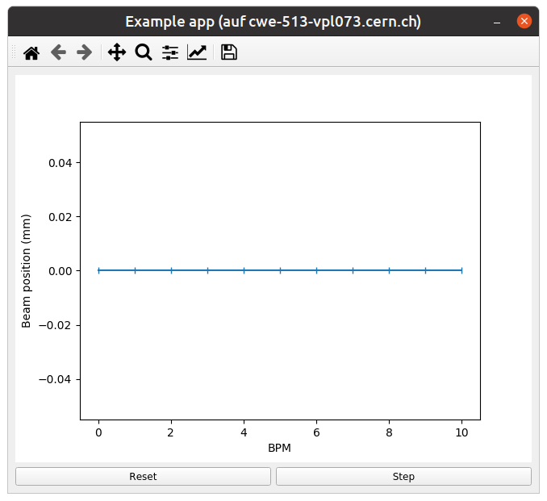

# COI Tutorial

This tutorial will lead you step-by-step through the implementation,
registration and publication of an example minimization problem. It touches on
the usage of the Common Optimization Interfaces (`cernml.coi`) in particular as
well as the problems of testing, packaging and machine communication in
general.

If you want to look up specific parts, feel free to skip to them. Each section
should be self-contained enough to answer at least several “How do I do X
again?” questions.

## The Problem

The problem we will solve is that of *electron beam steering* in AWAKE. The
problem is easy to solve and the machine is easy to understand. It consists of
ten corrector magnets interspersed with ten beam position monitors. Each
monitor gives us a position measurement and each corrector allows us to
modify the beam trajectory between monitors.

The goal is to keep all readings as close to zero as possible. For simplicity's
sake, we only focus on steering in the *horizontal* plane.

## A Clean Environment

If you're confident in your Python environment, feel free to skip this section.
This serves as a baseline from which beginners can start and be confident that
none of the experiments here will impact their other projects.

Start out by loading Acc-Py. We recommend using the latest Acc-Py Base
distribution (2020.11 at the time of this writing):

```bash
$ source /acc/local/share/python/acc-py/base/pro/setup.sh
```

If you put this line into your `~/.bash_profile` script, it will be executed
every time you log into your machine. If you don't want this, but you also
don't want to have to remember this long path, consider putting an alias in
instead:

```bash
alias setup-acc-py='source /acc/local/share/python/acc-py/base/pro/setup.sh'
```

The next step is to create a virtual environment that isolates the dependencies
of this project from your other projects. You can put it wherever you like, but
I prefer putting it under `/opt` to keep my home directory light:

```bash
$ sudo mkdir -p /opt/venvs        # Create a folder off your HOME.
$ sudo chown "$USER:" /opt/venvs  # Make it your own (instead of Root's).
$ python -m venv /opt/venvs/coi-example --system-site-packages
```

The `--system-site-packages` flag ensures that everything that is preinstalled
in the Acc-Py distribution already is available in your new environment.

Once the virtual environment is created, you can activate it like this:

```bash
$ source /opt/venvs/coi-example/bin/activate
$ # deactivate  # <-- And deactivate it again later like this!
```

After activating the environment, you can give it a test run by upgrading the
Pip package manager. This should be visible only within your virtual
environment:

```bash
$ pip install --upgrade pip
```

## Setting up the Project

Time to get started! Go into your projects folder and initialize a project
using Acc-Py:

```bash
$ cd ~/Projects
$ acc-py init coi-example
$ cd ./coi-example
```

(Don't forget to hit the TAB key often while typing the above lines, so that
your shell will auto-complete the words for you!)

For completeness' sake, let's add two files that `acc-py init` missed:
`pyproject.toml` and `.gitignore`.

The `pyproject.toml` file tells Python in a standardized way that we are indeed
using the [Setuptools](https://setuptools.readthedocs.io/) build system (and
not any of the other existing ones).

```toml
# pyproject.toml
[build-system]
requires = [
    "setuptools",
    "wheel",
]
build-backend = "setuptools.build_meta"
```

The `.gitignore` file tells Git which files to ignore. It should contain all
sorts of temporary files that are created by our tools and by Python itself
(e.g. `__pycache__/`). You can download a very comprehensive and universally
agreed-on file [from
Github](https://github.com/github/gitignore/blob/master/Python.gitignore).

Once this is done, we can edit the `setup.py` file created for us and fill in
the blanks. This is what the new requirements look like:

```python
# setup.py
REQUIREMENTS: dict = {
    "core": [
        "cernml.coi ~= 0.4.0",
        "gym >= 0.11",
        "matplotlib ~= 3.0",
        "numpy ~= 1.0",
        "pyjapc ~= 2.0",
    ],
    "test": [
        "pytest",
    ],
}
```

And this is the new `setup()` call:

```python
# setup.py (cont.)
setup(
    name="coi-example",
    version="0.0.1.dev0",
    author="Your Name",
    author_email="your.name@cern.ch",
    description="An example for how to use the cernml-coi package",
    long_description=LONG_DESCRIPTION,
    long_description_content_type="text/markdown",
    packages=find_packages(),
    python_requires=">=3.6, <4",
    classifiers=[
        "Programming Language :: Python :: 3",
        "Intended Audience :: Science/Research",
        "Natural Language :: English",
        "Operating System :: OS Independent",
        "Programming Language :: Python :: 3 :: Only",
        "Programming Language :: Python :: 3.6",
        "Programming Language :: Python :: 3.7",
        "Topic :: Scientific/Engineering :: Artificial Intelligence",
        "Topic :: Scientific/Engineering :: Physics",
    ],
    # Rest as before …
)
```


Of all these changes, only the description and the requirements were really
necessary. Things like classifiers are nice-to-have metadata that we could
technically also live without.

### Detour: Version Requirements

When specifying your requirements, be sure to put in a reasonable version
range.

* Being too lax with your requirements means that one of your dependencies
  might change and break your code without prior warning.
* Being too strict with your requirements means that other people will have a
  harder time making your package work in conjunction with theirs.

There are two common ways to specify version ranges:

- `~= 0.4.0` means: "I am compatible with all versions 0.4.X, but the last part
  must at least be 0". This is a good choice if the target adheres to [Semantic
  Versioning](https://semver.org/).
- `>=0.4, <0.5` means "I am compatible with all versions greater than (or equal
  to) 0.4.0 but lower than 0.5". This is a reasonable choice if you know a
  version of the target that works for you and a version that doesn't.

[Other
specifiers](https://www.python.org/dev/peps/pep-0440/#version-specifiers) may
also make sense if you know that the target makes very strong backwards
compatibility guarantees (e.g. NumPy or Setuptools).

## Interlude: Test Run

With this minimum in place, your package already can be installed via Pip! Give
it a try:

```bash
$ pip install .  # "." means "the current directory".
```

Once this is done, your package is installed in your environment and can be
imported by other packages without any path hackery:

```python
>>> import coi_example
>>> coi_example.__version__
'0.0.1'
>>> import pkg_resources
>>> pkg_resources.get_distribution('coi-example')
coi-example 0.0.1.dev0 (/opt/venvs/coi-example/lib/python3.7/site-packages)
```

Of course, you can always remove your package again:

```bash
$ pip uninstall coi-example
```

## Implementing Interactions with the Machine

It's time to actually start implementing our problem! We start by adding a new
module to our package:

```python
# coi_example/__init__.py
"""An example for how to use the cernml-coi package."""

from .env import AwakeElectronBeamSteering

__version__ = "0.0.1.dev0"
```

and importing a few things we will need later (and only those things):

```python
# coi_example/env.py
"""Implementation of the AWAKE e-beam steering problem."""

import time
import typing as t

import gym
import numpy as np
from cernml import coi
from pyjapc import PyJapc
```

Not much to see yet, but this will change quickly. Let's write a class that
either creates a JAPC object or accepts one from the outside. The latter is
necessary for embedding your problem into applications that manage JAPC
centrally.

```python
# coi_example/env.py (cont.)
class AwakeElectronBeamSteering:
    """Awake electron-beam steering optimization problem."""

    def __init__(self, japc: t.Optional[PyJapc] = None) -> None:
        if japc is None:
            japc = PyJapc("", incaAcceleratorName="AWAKE")
        self.japc = japc
```

Note that it's not required to use JAPC. It is perfectly valid to define an
optimization problem that does not use a `PyJapc` object and does not accept a
`japc` parameter in its constructor. This makes sense if e.g. you write
simulation of an optimization problem and don't actually talk to the machine.

In any case, with this class in place, we can write methods to communicate with
the corrector magnets. We define their addresses in a class-level attribute and
use JAPC to send and receive values. Note that in good Python code, class
attributes come *before* all your methods, including `__init__()`.

In the setting method, we introduce a small delay to ensure that the values
have arrived at the machine before we continue.

```python
# coi_example/env.py (cont.)
    CORRECTOR_ADDRS = (
        "logical.RCIBH.430029/K",
        "logical.RCIBH.430040/K",
        "logical.RCIBH.430104/K",
        "logical.RCIBH.430130/K",
        "logical.RCIBH.430204/K",
        "logical.RCIBH.430309/K",
        "logical.RCIBH.412344/K",
        "logical.RCIBH.412345/K",
        "logical.RCIBH.412347/K",
        "logical.RCIBH.412349/K",
    )

    def _send_corrector_values(self, values: t.Container[float]) -> None:
        if len(values) != len(self.CORRECTOR_ADDRS):
            raise ValueError(
                f"expected {len(self.CORRECTOR_ADDRS)} corrector values, "
                f"got {len(values)}"
            )
        for addr, value in zip(self.CORRECTOR_ADDRS, values):
            self.japc.setParam(addr, value)
        time.sleep(1)

    def _recv_corrector_values(self) -> np.ndarray:
        return np.array(self.japc.getParam(self.CORRECTOR_ADDRS))
```

Great! Let's do the same for the BPM readings. Because JAPC sends us back a
*lot* of information about each BPM, we have to write a small helper function
to extract the parts we are interested in. Note that the helper function is not
part of the class because it doesn't need to access any attributes of it.

Again, in real Python code, the class attribute `BPM_ADDRS` would come *before*
all methods.

```python
# coi_example/env.py (cont.)
    BPM_ADDRS = (
        "TT43.BPM.430028/Acquisition",
        "TT43.BPM.430039/Acquisition",
        "TT43.BPM.430103/Acquisition",
        "TT43.BPM.430129/Acquisition",
        "TT43.BPM.430203/Acquisition",
        "TT43.BPM.430308/Acquisition",
        "TT41.BPM.412343/Acquisition",
        "TT41.BPM.412345/Acquisition",
        "TT41.BPM.412347/Acquisition",
        "TT41.BPM.412349/Acquisition",
        "TT41.BPM.412351/Acquisition",
    )

    def _recv_bpm_readings(self) -> np.ndarray:
        values = self.japc.getParam(self.BPM_ADDRS)
        return np.array([_extract_bpm_reading(value) for value in values])


def _extract_bpm_reading(bpm_reading: dict) -> float:
    pos_ok: np.ndarray = bpm_reading["posOK"]
    if not any(pos_ok):
        return 0.0
    hor_pos: np.ndarray = bpm_reading["horPos"][pos_ok]
    return np.mean(hor_pos)
```

## Implementing the Interface

With this, we have all the primitive operations in place to start implementing
the optimization-problem interface. We kick this off by editing our class
definition: Instead of being its own independent class, it now subclasses the
[`SingleOptimizable`](api.html#cernml.coi.SingleOptimizable) interface:

```diff
  # coi_example/env.py
- class AwakeElectronBeamSteering:
+ class AwakeElectronBeamSteering(coi.SingleOptimizable):
```

The interface **requires** the following methods and attributes from us:

- [`metadata`](#metadata),
- [`optimization_space`](#optimization-space),
- [`get_initial_params()`](#get-initial-params),
- [`compute_single_objective()`](#compute-single-objective),

and the following ones are **optional** (i.e. we'll get to them later):

- [`constraints`](#constraints)
- [`objective_range`](#objective-range)
- [`render()`](#custom-rendering-output).

### Metadata

Let's start with the boring one, the metadata: Every optimization problem must
declare a minimal amount of information about itself so that the host
application that runs it knows how to handle it. We insert the
[`metadata`][cernml.coi.Problem.metadata] class attribute at the top of the
class, for maximum visibility:

```python
# coi_example/env.py
class AwakeElectronBeamSteering(coi.SingleOptimizable):
    """Awake electron-beam steering optimization problem."""

    metadata = {
        "render.modes": [],
        "cern.machine": coi.Machine.Awake,
        "cern.japc": True,
    }

    # Rest same as before …
```

Metadata is basically a free-form dictionary. You're free to put in your own
information if you think you need to. However, some keys are standardized and
have conventional meaning. The full list is given
[elsewhere][cernml.coi.Problem.metadata], but the important parts are:

- `render.modes`: This must be present and it must be a collection of strings.
  We'll get to the details [further down](#custom-rendering-output), but this
  declares the ways in which a user can visualize your problem. Because this
  list is empty right now, it means our problem can't be visualized at all.
  (We'll change this later.)
- `cern.machine`: This declares the [CERN accelerator][cernml.coi.Machine] that
  your problem belongs to. If this is set to None or is missing, we assume that
  this problem isn't related to any accelerator at all.
- `cern.japc`: If this is present and True, it means that our problem requires
  JAPC access. In such a case, our `__init__()` method must accept a keyword
  argument "japc". (which it already does)

### Optimization Space

The [optimization space][cernml.coi.SingleOptimizable.optimization_space] is a
definition of how many parameters we are optimizing (the degrees of freedom)
and what their valid domains are. We define it in our `__init__()` method,
which now looks like this:

```python
# coi_example/env.py
    def __init__(self, japc: PyJapc = None) -> None:
        if japc is None:
            japc = PyJapc(selector="", incaAcceleratorName="AWAKE")
        self.japc = japc
        ndim = len(self.CORRECTOR_ADDRS)
        self.optimization_space = gym.spaces.Box(-1.0, 1.0, shape=(ndim,))
```

For now, the space must always be a box, its shape must always be a one-tuple
with the number of degrees of freedom, and the bounds are always −1 and +1.
These restrictions may be lifted in the future.

### Get Initial Params

Every optimization procedure needs an initial point from where to start
optimization. The method
[`get_initial_params()`][cernml.coi.SingleOptimizable.get_initial_params]
provides this point to the host application.

While we are free to supply any initial point that we want (even a random
one!), we decide to measure the corrector values at instantiation and return
those. This gives the host the possibility to always return to a known-good
state: By simply using those initial settings without doing any optimization!

We add two lines to the end of `__init__()`:

```python
# coi_example/env.py
    def __init__(self, japc: PyJapc = None) -> None:
        if japc is None:
            japc = PyJapc(selector="", incaAcceleratorName="AWAKE")
        self.japc = japc
        ndim = len(self.CORRECTOR_ADDRS)
        self.optimization_space = gym.spaces.Box(-1.0, 1.0, shape=(ndim,))
        self.initial_kicks = self._recv_corrector_values()
        self.corrector_scale = 0.1
```

and implement the method:

```python
# coi_example/env.py (cont.)
    def get_initial_params(self) -> np.ndarray:
        return self.initial_kicks.copy() / self.corrector_scale
```

Note the `self.corrector_scale`: Our optimization space is normalized to the
range from −1 to 1, but the actual corrector values may not. For now, the
interface requires us to do this normalization manually. In the future, this
restriction may be lifted in a backwards-compatible manner.

### Compute Single Objective

Finally, it's time to write the core of the class: The cost function that an
optimizer will have to minimize. Note that the interface always assumes a
minimizer. If you have, for whatever reason, a maximizing optimizer you will
have to write a small adapter function that negates the result of
[`compute_single_objective()`][cernml.coi.SingleOptimizable.compute_single_objective].

With all the work we've already done, writing this method is straight-forward.
Again, we stay mindful of the fact that `params` is normalized to the range
from −1 to 1:

```python
# coi_example/env.py (cont.)
    def compute_single_objective(self, params: np.ndarray) -> float:
        self._send_corrector_values(params * self.corrector_scale)
        pos = self._recv_bpm_readings()
        rms = np.sqrt(np.mean(pos ** 2))
        return rms
```

### Registration

Once all this is done, we already can use this class in an interactive session.
However, to use it inside a host application, we must make one more step. We
need to [*register*][cernml.coi.register] it so that the host application can
find it without having to scour our entire package.

Registration is done with a single line at the global scope:

```python
class AwakeElectronBeamSteering(coi.SingleOptimizable):
    # Same as before …
    ...


coi.register(
    "AwakeElectronBeamSteering-v0",
    entry_point=AwakeElectronBeamSteering,
)
```

This line runs once our module is imported and ensures that our problem can be
found under the given name via the COI *registry*.

## Interlude: Test Run #2

With all of these pieces in place, we can finally run our optimization problem.
Fire up an interactive interpreter session, load an optimizer and our class,
and everything runs on its own:

```python
>>> import numpy as np
>>> from scipy.optimize import Bounds, minimize
>>> import coi_example
>>> from cernml import coi
>>> # Instantiate our class. By virtue of importing coi_example, our
>>> # class has appeared in the registry and can be found by name.
>>> awake = coi.make("AwakeElectronBeamSteering-v0")
>>> # Run minimization. This part is completely generic and works with
>>> # every imaginable subclass of SingleOptimizable.
>>> opt_space = awake.optimization_space
>>> minimize(
...     awake.compute_single_objective,
...     x0=awake.get_initial_params(),
...     bounds=Bounds(opt_space.low, opt_space.high),
... )
```

We can also pass our environment into the [Generic Optimization Frontend and
Framework][GeOFF] and run it in there:

```bash
$ acc-py app run acc-app-optimisation ./coi_example/
```

If we choose AWAKE as a machine and expand the environment selector, we should
see our class. Clicking on it should at least instantiate it without errors.
Unfortunately, we won't be able to run it, as this would require access to
AWAKE itself. If we were able to, this class would already be usable.


## Custom Rendering Output

The [Generic Optimization Frontend and Framework][GeOFF] already provides some
plotting out of the box; concretely, this is the loss over time, the corrector
settings over time, and any possible [constraints](#constraints). For most
optimization problems, this is all they need and no more code needs to be
written.

Nonetheless, the COI provide way to implement fully flexible and customized
plotting facilities for your optimization problem. This is provided through the
`render()` method, which has been taken over from the [OpenAI Gym][Gym]
interface for reinforcement learning.

### The mechanics

The way it works is that every time the [`render()`][cernml.coi.Problem.render] method is called on a
problem, it should visualize its current state in some way. (In our case, the
current state is the latest readings from the BPMs.) The way in which this
should happen is the *render mode*, which is passed to the method as a string.

A few render modes have already been predefined by [Gym][] and the COI package.
You can find the full list in the [API docs][cernml.coi.Problem.render].
The ones that interest us are:

- `"human"`: The default render mode. The problem should present itself on the
  current display or terminal and return None.
- `"matplotlib_figures"`: Create one or more `matplotlib.figure.Figure` objects
  and use them for visualization. Return a list of `Figure` objects.

Like for many other parts of the COI, implementing rendering involves two
steps:

1. Declare the supported render modes in the `render.modes`
   [metadata][cernml.coi.Problem.metadata].
2. Override the [`Problem.render()`][cernml.coi.Problem.render] method.

### Implementing `render("human")`

We start out by modifying a few lines of code we've already written:

```diff
  # coi_example/env.py
  import gym
  import numpy as np
  from cernml import coi
+ from matplotlib import pyplot
+ from matplotlib.axes import Axes
  from pyjapc import PyJapc
```

```diff
  # coi_example/env.py (cont.)
      metadata = {
-         "render.modes": [],
+         "render.modes": ["human"],
          "cern.machine": coi.Machine.Awake,
          "cern.japc": True,
      }
```

```diff
  # coi_example/env.py (cont.)
      def __init__(self, japc: PyJapc = None) -> None:
          ...
          self.initial_kicks = self._recv_corrector_values()
+         self.latest_readings = self._recv_bpm_readings()
          self.corrector_scale = 0.1
```

```diff
  # coi_example/env.py (cont.)
      def compute_single_objective(self, params: np.ndarray) -> float:
          self._send_corrector_values(params * self.corrector_scale)
-         pos = self._recv_bpm_readings()
-         rms = np.sqrt(np.mean(pos ** 2))
+         self.latest_readings = self._recv_bpm_readings()
+         rms = np.sqrt(np.mean(self.latest_readings ** 2))
          return rms
```

In short, we import a few things that we will need; declare that we implement
the human rendering mode; and we keep the latest BPM readings around. The last
point is important to speed up the [`render()`][cernml.coi.Problem.render]
call.

With this out of the way, we can start implementing the method.

```python
# coi_example/env.py (cont.)
    def render(self, mode: str = "human") -> t.Any:
        if mode == "human":
            _, axes = pyplot.subplots()
            self.update_axes(axes)
            pyplot.show()
            return None
        return super().render(mode)

    def update_axes(self, axes: Axes) -> None:
        """Render this problem into the given axes."""
        axes.clear()
        axes.plot(self.latest_readings, "|-")
        axes.set_xlabel("BPM")
        axes.set_ylabel("Beam position (mm)")
```

The implementation of [`render()`][cernml.coi.Problem.render] follows a
characteristic pattern: A series of `if mode == ...` statements (though it's
only one here), followed by a call to `super().render()`. Each `if` handles one
of the defined render modes, and if the render mode is unknown, we delegate to
the base implementation, which raises a `NotImplementedError`. This prevents us
from silently swallowing typos in the render mode.

Another notable choice is that we have put the rendering into a separate
method. Not only does this keep the code cleaner, it will also be useful later,
when we also implement the `matplotlib_figures` render mode.

To test our implementation, we can simply call the method in an interactive
Python session:

```python
>>> from pyjapc import PyJapc
>>> from coi_example import AwakeElectronBeamSteering
>>> # Create our own PyJapc and pass `noSet` so that we don't
>>> # accidentally interfere with the accelerator operations.
>>> japc = PyJapc("", noSet=True, incaAcceleratorName="AWAKE")
>>> env = AwakeElectronBeamSteering(japc)
>>> env.render()
```

Unfortunately, unless AWAKE itself is operational, this will likely only
produce a flat line. Nonetheless, it shows that our method does what it is
supposed to do.


### Implementing `render("matplotlib_figures")`

The human render mode is useful for quick debugging, but it would not work when
embedding our optimization problem into a GUI. Most crucially, `pyplot.show()`
is a blocking function – it waits indefinitely and only returns once the user
closes the window. If we called it inside a GUI, the entire application would
freeze indefinitely!

Hence, we need another render mode, one that leaves the caller of
[`render()`][cernml.coi.Problem.render] in full control. At the same time, we
don't want to give up the convenience of the Matplotlib API. This is exactly
what `"matplotlib_figures"` is for.

**An important detail**: The Pyplot API is so convenient because it manages a
lot of global state for us. When embedding our class into a GUI app, the app
will do this state management for us. If we now used Pyplot *on top* of the
GUI, the two might get into conflict with each other about who manages what.
For this reason, *it is crucial* for `"matplotlib_figures"` that no `pyplot`
function is used. We will have to use the underlying Matplotlib API instead.
Luckily, `update_axes()` already does so!

To implement the new render mode, once again, we need to make a few changes in
the previous code:

```diff
  # coi_example/env.py
  import gym
  import numpy as np
  from cernml import coi
  from matplotlib import pyplot
  from matplotlib.axes import Axes
+ from matplotlib.figure import Figure
  from pyjapc import PyJapc
```

```diff
  # coi_example/env.py (cont.)
      metadata = {
-         "render.modes": ["human"],
+         "render.modes": ["human", "matplotlib_figures"],
          "cern.machine": coi.Machine.Awake,
          "cern.japc": True,
      }
```

```diff
  # coi_example/env.py (cont.)
      def __init__(self, japc: PyJapc = None) -> None:
          ...
          self.latest_readings = self._recv_bpm_readings()
          self.corrector_scale = 0.1
+         self.figure = None
```

Unlike `render("human")`, our new code will be called many times in a loop.
Hence, we want to avoid recreating the `Figure` object again and again. To do
so, we will bind it to an attribute after creation.

We also import the `Figure` class itself. The reason is, as mentioned, that we
cannot use `pyplot` to create our figure. Finally, we update our metadata to
reflect the newly supported render mode.

With these changes in place, our new [`render()`][cernml.coi.Problem.render]
method looks as follows:

```python
# coi_example/env.py (cont.)

    def render(self, mode: str = "human") -> t.Any:
        if mode == "human":
            _, axes = pyplot.subplots()
            self.update_axes(axes)
            pyplot.show()
            return None
        if mode == "matplotlib_figures":
            if self.figure is None:
                self.figure = Figure()
                axes = self.figure.subplots()
            else:
                [axes] = self.figure.axes
            self.update_axes(axes)
            return [self.figure]
        return super().render(mode)
```

As you can see, the new code is not all that difficult! We first check if our
figure already exists. If not, we create it by calling the constructor. We then
call the `Figure.subplots()` method; it works almost exactly like
`pyplot.subplots()`, but uses an existing figure. This gives an `Axes` object
to pass to `update_axes()`, which stays exactly the same.

In the case that the figure already exists, we access its `axes` attribute.
This is a list of the axes that have already been created in this figure. We
unpack this list using the `[axes] = ...` syntax and then continue on as in the
first case.

In both cases, we end up returning a list of all figures that we have created.
(We could create more than one if we wanted!) Now the GUI can call our
[`render()`][cernml.coi.Problem.render] method, get access to our figure, and
put it into some sort of GUI widget for display purposes. And because the GUI
stays in control, it can take care of GUI things like resizing, zooming, etc.
for us.

And just like that, our optimization problem is ready to be embedded into a GUI
application. Here is a very simple one, in just 53 lines of code:

```python
import jpype
from matplotlib.backends.qt_compat import QtWidgets
from matplotlib.backends.backend_qt5agg import (
    FigureCanvasQTAgg as FigureCanvas,
    NavigationToolbar2QT as NavigationToolbar,
)
from pyjapc import PyJapc
from coi_example import AwakeElectronBeamSteering
from cenrml.coi.mpl_utils import iter_matplotlib_figures

class MainWindow(QtWidgets.QMainWindow):
    def __init__(self) -> None:
        super().__init__()
        japc = PyJapc("", noSet=True, incaAcceleratorName="AWAKE")
        self.problem = AwakeElectronBeamSteering(japc)
        self.x_0 = self.problem.get_initial_params()
        figures = self.problem.render("matplotlib_figures")
        # We assume just a single figure.
        for _, figure in iter_matplotlib_figures(figures):
          self.canvas = FigureCanvas(figure)
        reset = QtWidgets.QPushButton("Reset", clicked=self.on_reset)
        step = QtWidgets.QPushButton("Step", clicked=self.on_step)
        widget = QtWidgets.QWidget()
        self.setWindowTitle("Example app")
        self.setCentralWidget(widget)
        self.addToolBar(NavigationToolbar(self.canvas, self))
        buttons = QtWidgets.QHBoxLayout()
        buttons.addWidget(reset)
        buttons.addWidget(step)
        layout = QtWidgets.QVBoxLayout(widget)
        layout.addWidget(self.canvas)
        layout.addLayout(buttons)

    def on_reset(self) -> None:
        self.problem.compute_single_objective(self.x_0)
        self.problem.render("matplotlib_figures")
        self.canvas.draw_idle()

    def on_step(self) -> None:
        params = self.problem.optimization_space.sample()
        self.problem.compute_single_objective(params)
        self.problem.render("matplotlib_figures")
        self.canvas.draw_idle()

def main():
    app = QtWidgets.QApplication([])
    window = MainWindow()
    window.show()
    app.exec_()
    jpype.JPackage("java").lang.Thread.detach()

if __name__ == "__main__":
    main()
```



[GeOFF]: https://gitlab.cern.ch/vkain/acc-app-optimisation
[Gym]: https://github.com/openai/gym/
[cernml.coi.Machine]: api.html#cernml.coi.Machine
[cernml.coi.Problem.metadata]: api.html#cernml.coi.Problem.metadata
[cernml.coi.Problem.render]: api.html#cernml.coi.Problem.render
[cernml.coi.SingleOptimizable.optimization_space]: api.html#cernml.coi.SingleOptimizable.optimization_space
[cernml.coi.SingleOptimizable.get_initial_params]: api.html#cernml.coi.SingleOptimizable.get_initial_params
[cernml.coi.SingleOptimizable.compute_single_objective]: api.html#cernml.coi.SingleOptimizable.compute_single_objective
[cernml.coi.register]: api.html#cernml.coi.register
