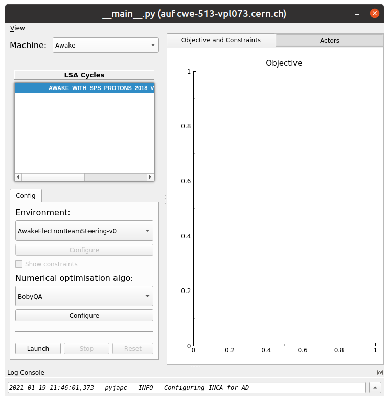
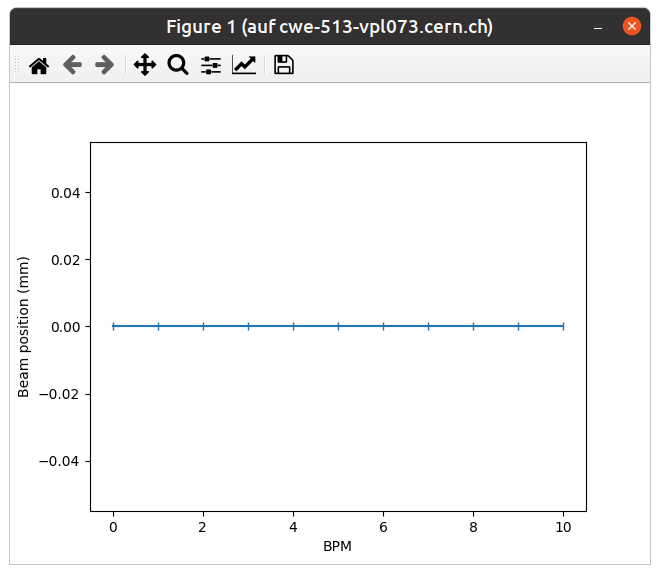
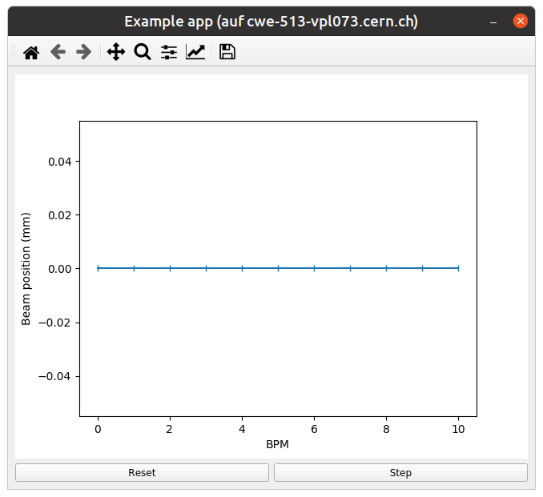

..
    SPDX-FileCopyrightText: 2020-2024 CERN
    SPDX-FileCopyrightText: 2023-2024 GSI Helmholtzzentrum für Schwerionenforschung
    SPDX-FileNotice: All rights not expressly granted are reserved.

    SPDX-License-Identifier: GPL-3.0-or-later OR EUPL-1.2+

Implementing ``SingleOptimizable``
==================================

This tutorial will lead you step-by-step through the implementation of an
example minimization problem. It touches on the usage of the Common
Optimization Interfaces (`cernml.coi`) in particular as well as the problems of
testing, packaging and machine communication in general.

If you want to look up specific parts, feel free to skip to them. Each section
should be self-contained enough to answer at least several “How do I do X
again?” questions.

The Problem
-----------

The first step (as always) is to set up your general project structure, declare
dependencies, etc. We assume that you've already done so. If not, :doc:`the
previous tutorial <packaging>` will walk you through these steps.

Interactions with the Machine
-----------------------------

It's time to actually start implementing our problem! We start by adding a new
module to our package:

.. code-block:: python

    # coi_example/__init__.py
    """An example for how to use the cernml-coi package."""

    from .env import AwakeElectronBeamSteering

    __version__ = "0.0.1.dev0"

and importing a few things we will need later (and only those things):

.. code-block:: python

    # coi_example/env.py
    """Implementation of the AWAKE e-beam steering problem."""

    import time
    import typing as t

    import gymnasium as gym
    import numpy as np
    from cernml import coi
    from pyjapc import PyJapc

Not much to see yet, but this will change quickly. Let's write a class that
either creates a JAPC object or accepts one from the outside. The latter is
necessary for embedding your problem into applications that manage JAPC
centrally.

.. code-block:: python

    # coi_example/env.py (cont.)
    class AwakeElectronBeamSteering:
        """Awake electron-beam steering optimization problem."""

        def __init__(self, japc: t.Optional[PyJapc] = None) -> None:
            if japc is None:
                japc = PyJapc("", incaAcceleratorName="AWAKE")
            self.japc = japc

Note that it's not required to use JAPC. It is perfectly valid to define an
optimization problem that does not use a `~pyjapc.PyJapc` object and does not
accept a *japc* parameter in its constructor. This makes sense if e.g. you
write simulation of an optimization problem and don't actually talk to the
machine.

In any case, with this class in place, we can write methods to communicate with
the corrector magnets. We define their addresses in a class-level attribute and
use JAPC to send and receive values. Note that in good Python code, class
attributes come *before* all your methods, including ``__init__()``.

In the setting method, we introduce a small delay to ensure that the values
have arrived at the machine before we continue.

.. code-block:: python

    # coi_example/env.py (cont.)
        CORRECTOR_ADDRS = (
            "logical.RCIBH.430029/K",
            "logical.RCIBH.430040/K",
            "logical.RCIBH.430104/K",
            "logical.RCIBH.430130/K",
            "logical.RCIBH.430204/K",
            "logical.RCIBH.430309/K",
            "logical.RCIBH.412344/K",
            "logical.RCIBH.412345/K",
            "logical.RCIBH.412347/K",
            "logical.RCIBH.412349/K",
        )

        def _send_corrector_values(self, values: t.Container[float]) -> None:
            if len(values) != len(self.CORRECTOR_ADDRS):
                raise ValueError(
                    f"expected {len(self.CORRECTOR_ADDRS)} corrector values, "
                    f"got {len(values)}"
                )
            for addr, value in zip(self.CORRECTOR_ADDRS, values):
                self.japc.setParam(addr, value)
            time.sleep(1)

        def _recv_corrector_values(self) -> np.ndarray:
            return np.array(self.japc.getParam(self.CORRECTOR_ADDRS))

Great! Let's do the same for the BPM readings. Because JAPC sends us back a
*lot* of information about each BPM, we have to write a small helper function
to extract the parts we are interested in. Note that the helper function is not
part of the class because it doesn't need to access any attributes of it.

Again, in real Python code, the class attribute ``BPM_ADDRS`` would come
*before* all methods.

.. code-block:: python

    # coi_example/env.py (cont.)
        BPM_ADDRS = (
            "TT43.BPM.430028/Acquisition",
            "TT43.BPM.430039/Acquisition",
            "TT43.BPM.430103/Acquisition",
            "TT43.BPM.430129/Acquisition",
            "TT43.BPM.430203/Acquisition",
            "TT43.BPM.430308/Acquisition",
            "TT41.BPM.412343/Acquisition",
            "TT41.BPM.412345/Acquisition",
            "TT41.BPM.412347/Acquisition",
            "TT41.BPM.412349/Acquisition",
            "TT41.BPM.412351/Acquisition",
        )

        def _recv_bpm_readings(self) -> np.ndarray:
            values = self.japc.getParam(self.BPM_ADDRS)
            return np.array([_extract_bpm_reading(value) for value in values])

    def _extract_bpm_reading(bpm_reading: dict) -> float:
        pos_ok: np.ndarray = bpm_reading["posOK"]
        if not any(pos_ok):
            return 0.0
        hor_pos: np.ndarray = bpm_reading["horPos"][pos_ok]
        return np.mean(hor_pos)

The Interface
-------------

With this, we have all the primitive operations in place to start implementing
the optimization-problem interface. We kick this off by editing our class
definition: Instead of being its own independent class, it now subclasses the
`~cernml.coi.SingleOptimizable` interface:

.. code-block:: diff

      # coi_example/env.py
    - class AwakeElectronBeamSteering:
    + class AwakeElectronBeamSteering(coi.SingleOptimizable):

The interface **requires** the following information from us:

- :ref:`metadata`
- :ref:`tutorials/implement-singleoptimizable:the optimization space`
- :ref:`tutorials/implement-singleoptimizable:the initial point *x₀*`
- :ref:`tutorials/implement-singleoptimizable:the objective function`

and the following ones are **optional** (i.e. we'll get to them later):

- :ref:`tutorials/implement-singleoptimizable:constraints`
- :ref:`tutorials/implement-singleoptimizable:custom rendering output`

The Metadata
^^^^^^^^^^^^

Let's start with the boring one, the metadata: Every optimization problem must
declare a minimal amount of information about itself so that the host
application that runs it knows how to handle it. We insert the
`~cernml.coi.Problem.metadata` class attribute at the top of the class, for
maximum visibility:

.. code-block:: python

    # coi_example/env.py
    class AwakeElectronBeamSteering(coi.SingleOptimizable):
        """Awake electron-beam steering optimization problem."""

        metadata = {
            "render_modes": [],
            "cern.machine": coi.Machine.AWAKE,
            "cern.japc": True,
        }

        # Rest same as before …

Metadata is basically a free-form dictionary. You're free to put in your own
information if you think you need to. However, some keys are standardized and
have conventional meaning. The full list is given :attr:`elsewhere
<cernml.coi.Problem.metadata>`, but the important parts are:

``render_modes``
    This must be present and it must be a collection of strings. We'll get to
    the details :ref:`further down
    <tutorials/implement-singleoptimizable:custom rendering output>`, but this
    declares the ways in which a user can visualize your problem. Because this
    list is empty right now, it means our problem can't be visualized at all.
    (We'll change this later.)
``cern.machine``
    This declares the :class:`CERN accelerator <cernml.coi.Machine>` that your
    problem belongs to. If this is set to None or is missing, we assume that
    this problem isn't related to any accelerator at all.
``cern.japc``
    If this is present and True, it means that our problem requires JAPC
    access. In such a case, our ``__init__()`` method must accept a keyword
    argument *japc* (which it already does).

The Optimization Space
^^^^^^^^^^^^^^^^^^^^^^

The `~cernml.coi.SingleOptimizable.optimization_space` is a definition of how
many parameters we are optimizing (the degrees of freedom) and what their valid
domains are. We define it in our ``__init__()`` method, which now looks like
this:

.. code-block:: python

    # coi_example/env.py
        def __init__(self, japc: PyJapc = None) -> None:
            if japc is None:
                japc = PyJapc(selector="", incaAcceleratorName="AWAKE")
            self.japc = japc
            ndim = len(self.CORRECTOR_ADDRS)
            self.optimization_space = gym.spaces.Box(-1.0, 1.0, shape=(ndim,))

For now, the space must always be a box, its shape must always be a one-tuple
with the number of degrees of freedom, and the bounds are always −1 and +1.
These restrictions may be lifted in the future.

The Initial Point *x₀*
^^^^^^^^^^^^^^^^^^^^^^

Every optimization procedure needs an initial point from where to start
optimization. The method `~cernml.coi.SingleOptimizable.get_initial_params()`
provides this point to the host application.

While we are free to supply any initial point that we want (even a random
one!), we decide to measure the corrector values at instantiation and return
those. This gives the host the possibility to always return to a known-good
state: By simply using those initial settings without doing any optimization!

We add two lines to the end of ``__init__()``:

.. code-block:: python

    # coi_example/env.py
        def __init__(self, japc: PyJapc = None) -> None:
            if japc is None:
                japc = PyJapc(selector="", incaAcceleratorName="AWAKE")
            self.japc = japc
            ndim = len(self.CORRECTOR_ADDRS)
            self.optimization_space = gym.spaces.Box(-1.0, 1.0, shape=(ndim,))
            self.initial_kicks = self._recv_corrector_values()
            self.corrector_scale = 0.1

and implement the method:

.. code-block:: python

    # coi_example/env.py (cont.)
        def get_initial_params(self) -> np.ndarray:
            return self.initial_kicks.copy() / self.corrector_scale

Note the ``self.corrector_scale``: Our optimization space is normalized to the
range from −1 to 1, but the actual corrector values may not. For now, the
interface requires us to do this normalization manually. In the future, this
restriction may be lifted in a backwards-compatible manner.

The Objective Function
^^^^^^^^^^^^^^^^^^^^^^

Finally, it's time to write the core of the class: The cost function that an
optimizer will have to minimize. Note that the interface always assumes a
minimizer. If you have, for whatever reason, a maximizing optimizer you will
have to write a small adapter function that negates the result of
`~cernml.coi.SingleOptimizable.compute_single_objective()`.

With all the work we've already done, writing this method is straight-forward.
Again, we stay mindful of the fact that *params* is normalized to the range
from −1 to 1:

.. code-block:: python

    # coi_example/env.py (cont.)
        def compute_single_objective(self, params: np.ndarray) -> float:
            self._send_corrector_values(params * self.corrector_scale)
            pos = self._recv_bpm_readings()
            rms = np.sqrt(np.mean(pos ** 2))
            return rms

Class Registration
^^^^^^^^^^^^^^^^^^

Once all this is done, we already can use this class in an interactive session.
However, to use it inside a host application, we must make one more step. We
need to :meth:`register <cernml.coi.register()>` it so that the host
application can find it without having to scour our entire package.

Registration is done with a single line at the global scope:

.. code-block:: python

    class AwakeElectronBeamSteering(coi.SingleOptimizable):
        # Same as before …
        ...

    coi.register(
        "AwakeElectronBeamSteering-v0",
        entry_point=AwakeElectronBeamSteering,
    )

This line runs once our module is imported and ensures that our problem can be
found under the given name via the COI *registry*.

Optimization Test Run
---------------------

With all of these pieces in place, we can finally run our optimization problem.
Fire up an interactive interpreter session, load an optimizer and our class,
and everything runs on its own:

.. code-block:: python

    >>> import numpy as np
    >>> from scipy.optimize import Bounds, minimize
    >>> import coi_example
    >>> from cernml import coi
    >>> # Instantiate our class. By virtue of importing coi_example, our
    >>> # class has appeared in the registry and can be found by name.
    >>> awake = coi.make("AwakeElectronBeamSteering-v0")
    >>> # Run minimization. This part is completely generic and works with
    >>> # every imaginable subclass of SingleOptimizable.
    >>> opt_space = awake.optimization_space
    >>> minimize(
    ...     awake.compute_single_objective,
    ...     x0=awake.get_initial_params(),
    ...     bounds=Bounds(opt_space.low, opt_space.high),
    ... )

We can also pass our environment into the `Generic Optimization Frontend and
Framework <GeOFF_>`_ and run it in there:

.. _GeOFF: https://gitlab.cern.ch/geoff/geoff-app

.. code-block:: shell-session

    $ acc-py app run acc-app-optimisation ./coi_example/

If we choose AWAKE as a machine and expand the environment selector, we should
see our class. Clicking on it should at least instantiate it without errors.
Unfortunately, we won't be able to run it, as this would require access to
AWAKE itself. If we were able to, this class would already be usable.

        optimization problem loaded

Constraints
-----------

Some optimization algorithms (such as COBYLA_) have a concept of *constraints*,
i.e. linear or nonlinear functions whose value must be kept within certain
bounds during optimization. The API allows specifying such
`~cernml.coi.SingleOptimizable.constraints` for your optimization problem, if
it makes sense. To do this, you have to use
:class:`~scipy.optimize.LinearConstraint` or
:class:`~scipy.optimize.NonlinearConstraint` from the Scipy package:

.. _COBYLA: https://www.doi.org/10.1007/978-94-015-8330-5_4

.. code-block:: python

    from cernml import coi
    from scipy.optimize import NonlinearConstraint

    class UnrelatedProblem(coi.SingleOptimizable):
        def __init__(self):
            self.constraints = [
                NonlinearConstraint(self._constrain_beam_intensity, 1e10, np.inf),
            ]
            ...

        def compute_single_objective(self, params):
            self._apply_params(params)
            return self._calculate_loss()

        def _constrain_beam_intensity(self, params):
            self._apply_params(params)
            return self._calculate_beam_intensity()

        ...

.. warning::
   Not all optimizers support constraints! When writing your optimization
   problem, you *must* assume and expect that the optimizer will ignore your
   constraints. Do not use constraints to implement safety-critical checks and
   limits. Use `~cernml.coi.SingleOptimizable.optimization_space` and, in case
   of emergencies, raise an exception inside
   `~cernml.coi.SingleOptimizable.compute_single_objective()`.

Custom Rendering Output
-----------------------

The `Generic Optimization Frontend and Framework (GeOFF) <GeOFF_>`_ already
provides some plotting out of the box; concretely, this is the loss over time,
the corrector settings over time, and any possible [constraints](#constraints).
For most optimization problems, this is all they need and no more code needs to
be written.

Nonetheless, the COI provide way to implement fully flexible and customized
plotting facilities for your optimization problem. This is provided through the
`~cernml.coi.Problem.render()` method, which has been taken over from the
`OpenAI Gym <Gym_>`_ interface for reinforcement learning.

.. _Gym: https://github.com/openai/gym/

The Mechanics
^^^^^^^^^^^^^

The way it works is that every time the `~cernml.coi.Problem.render()`
method is called on a problem, it should visualize its current state in some
way. (In our case, the current state is the latest readings from the BPMs.) The
way in which this should happen is the *render mode*, which is passed to the
method as a string.

A few render modes have already been predefined by Gym_ and the COI package.
You can find the full list in the :meth:`API docs
<cernml.coi.Problem.render()>`. The ones that interest us are:

``"human"``
    The default render mode. The problem should present itself on the current
    display or terminal and return None.
``"matplotlib_figures"``
    Create one or more :class:`matplotlib.figure.Figure` objects and use them
    for visualization. Return a list of :class:`~matplotlib.figure.Figure`
    objects.

Like for many other parts of the COI, implementing rendering involves two
steps:

1. Declare the supported render modes in the ``render_modes``
   `~cernml.coi.Problem.metadata`.
2. Override the `Problem.render() <cernml.coi.Problem.render()>` method.

Rendering for Humans
^^^^^^^^^^^^^^^^^^^^

We start out by modifying a few lines of code we've already written:

.. code-block:: diff

      # coi_example/env.py
      import gymnasium as gym
      import numpy as np
      from cernml import coi
    + from matplotlib import pyplot
    + from matplotlib.axes import Axes
      from pyjapc import PyJapc

.. code-block:: diff

      # coi_example/env.py (cont.)
          metadata = {
    -         "render_modes": [],
    +         "render_modes": ["human"],
              "cern.machine": coi.Machine.AWAKE,
              "cern.japc": True,
          }

.. code-block:: diff

      # coi_example/env.py (cont.)
          def __init__(self, japc: PyJapc = None) -> None:
              ...
              self.initial_kicks = self._recv_corrector_values()
    +         self.latest_readings = self._recv_bpm_readings()
              self.corrector_scale = 0.1

.. code-block:: diff

      # coi_example/env.py (cont.)
          def compute_single_objective(self, params: np.ndarray) -> float:
              self._send_corrector_values(params * self.corrector_scale)
    -         pos = self._recv_bpm_readings()
    -         rms = np.sqrt(np.mean(pos ** 2))
    +         self.latest_readings = self._recv_bpm_readings()
    +         rms = np.sqrt(np.mean(self.latest_readings ** 2))
              return rms

In short, we import a few things that we will need; declare that we implement
the human rendering mode; and we keep the latest BPM readings around. The last
point is important to speed up the `~cernml.coi.Problem.render()` call.

With this out of the way, we can start implementing the method.

.. code-block:: python

    # coi_example/env.py (cont.)
        def render(self, mode: str = "human") -> t.Any:
            if mode == "human":
                _, axes = pyplot.subplots()
                self.update_axes(axes)
                pyplot.show()
                return None
            return super().render(mode)

        def update_axes(self, axes: Axes) -> None:
            """Render this problem into the given axes."""
            axes.clear()
            axes.plot(self.latest_readings, "|-")
            axes.set_xlabel("BPM")
            axes.set_ylabel("Beam position (mm)")

The implementation of `~cernml.coi.Problem.render()` follows a characteristic
pattern: A series of ``if mode == ...`` statements (though it's only one here),
followed by a call to ``super().render()``. Each ``if`` handles one of the
defined render modes, and if the render mode is unknown, we delegate to the
base implementation, which raises a :class:`NotImplementedError`. This prevents
us from silently swallowing typos in the render mode.

Another notable choice is that we have put the rendering into a separate
method. Not only does this keep the code cleaner, it will also be useful later,
when we also implement the ``matplotlib_figures`` render mode.

To test our implementation, we can simply call the method in an interactive
Python session:

.. code-block:: python

    >>> from pyjapc import PyJapc
    >>> from coi_example import AwakeElectronBeamSteering
    >>> # Create our own PyJapc and pass `noSet` so that we don't
    >>> # accidentally interfere with the accelerator operations.
    >>> japc = PyJapc("", noSet=True, incaAcceleratorName="AWAKE")
    >>> env = AwakeElectronBeamSteering(japc)
    >>> env.render()

Unfortunately, unless AWAKE itself is operational, this will likely only
produce a flat line. Nonetheless, it shows that our method does what it is
supposed to do.

Rendering for the App
^^^^^^^^^^^^^^^^^^^^^

The human render mode is useful for quick debugging, but it would not work when
embedding our optimization problem into a GUI. Most crucially, ``pyplot.show()``
is a blocking function – it waits indefinitely and only returns once the user
closes the window. If we called it inside a GUI, the entire application would
freeze indefinitely!

Hence, we need another render mode, one that leaves the caller of
`~cernml.coi.Problem.render()` in full control. At the same time, we don't
want to give up the convenience of the Matplotlib API. This is exactly what
``"matplotlib_figures"`` is for.

**An important detail**: The Pyplot API is so convenient because it manages a
lot of global state for us. When embedding our class into a GUI app, the app
will do this state management for us. If we now used Pyplot *on top* of the
GUI, the two might get into conflict with each other about who manages what.
For this reason, *it is crucial* for ``"matplotlib_figures"`` that no
:mod:`~matplotlib.pyplot` function is used. We will have to use the underlying
Matplotlib API instead. Luckily, ``update_axes()`` already does so!

To implement the new render mode, once again, we need to make a few changes in
the previous code:

.. code-block:: diff

      # coi_example/env.py
      import gymnasium as gym
      import numpy as np
      from cernml import coi
      from matplotlib import pyplot
      from matplotlib.axes import Axes
    + from matplotlib.figure import Figure
      from pyjapc import PyJapc

.. code-block:: diff

      # coi_example/env.py (cont.)
          metadata = {
    -         "render_modes": ["human"],
    +         "render_modes": ["human", "matplotlib_figures"],
              "cern.machine": coi.Machine.AWAKE,
              "cern.japc": True,
          }

.. code-block:: diff

      # coi_example/env.py (cont.)
          def __init__(self, japc: PyJapc = None) -> None:
              ...
              self.latest_readings = self._recv_bpm_readings()
              self.corrector_scale = 0.1
    +         self.figure = None

Unlike ``render("human")``, our new code will be called many times in a loop.
Hence, we want to avoid recreating the :class:`~matplotlib.figure.Figure`
object again and again. To do so, we will bind it to an attribute after
creation.

We also import the :class:`~matplotlib.figure.Figure` class itself. The reason
is, as mentioned, that we cannot use :mod:`~matplotlib.pyplot` to create our
figure. Finally, we update our metadata to reflect the newly supported render
mode.

With these changes in place, our new `~cernml.coi.Problem.render()` method
looks as follows:

.. code-block:: python

    # coi_example/env.py (cont.)

        def render(self, mode: str = "human") -> t.Any:
            if mode == "human":
                _, axes = pyplot.subplots()
                self.update_axes(axes)
                pyplot.show()
                return None
            if mode == "matplotlib_figures":
                if self.figure is None:
                    self.figure = Figure()
                    axes = self.figure.subplots()
                else:
                    [axes] = self.figure.axes
                self.update_axes(axes)
                return [self.figure]
            return super().render(mode)

As you can see, the new code is not all that difficult! We first check if our
figure already exists. If not, we create it by calling the constructor. We then
call the :meth:`Figure.subplots() <matplotlib.figure.Figure.subplots()>`
method; it works almost exactly like :func:`pyplot.subplots()
<matplotlib.pyplot.subplots()>`, but uses an existing figure. This gives an
:class:`~matplotlib.axes.Axes` object to pass to ``update_axes()``, which stays
exactly the same.

In the case that the figure already exists, we access its
:attr:`~matplotlib.figure.Figure.axes` attribute. This is a list of the axes
that have already been created in this figure. We unpack this list using the
``[axes] = ...`` syntax and then continue on as in the first case.

In both cases, we end up returning a list of all figures that we have created.
(We could create more than one if we wanted!) Now the GUI can call our
`~cernml.coi.Problem.render()` method, get access to our figure, and put it
into some sort of GUI widget for display purposes. And because the GUI stays in
control, it can take care of GUI things like resizing, zooming, etc. for us.

And just like that, our optimization problem is ready to be embedded into a GUI
application. Here is a very simple one, in just 54 lines of code:

.. code-block:: python

    import jpype
    from matplotlib.backends.qt_compat import QtWidgets
    from matplotlib.backends.backend_qt5agg import (
        FigureCanvasQTAgg as FigureCanvas,
        NavigationToolbar2QT as NavigationToolbar,
    )
    from pyjapc import PyJapc
    from coi_example import AwakeElectronBeamSteering
    # Requires `pip install cernml-coi-utils`.
    from cernml.mpl_utils import iter_matplotlib_figures

    class MainWindow(QtWidgets.QMainWindow):
        def __init__(self) -> None:
            super().__init__()
            japc = PyJapc("", noSet=True, incaAcceleratorName="AWAKE")
            self.problem = AwakeElectronBeamSteering(japc)
            self.x_0 = self.problem.get_initial_params()
            figures = self.problem.render("matplotlib_figures")
            # We assume just a single figure.
            for _, figure in iter_matplotlib_figures(figures):
              self.canvas = FigureCanvas(figure)
            reset = QtWidgets.QPushButton("Reset", clicked=self.on_reset)
            step = QtWidgets.QPushButton("Step", clicked=self.on_step)
            widget = QtWidgets.QWidget()
            self.setWindowTitle("Example app")
            self.setCentralWidget(widget)
            self.addToolBar(NavigationToolbar(self.canvas, self))
            buttons = QtWidgets.QHBoxLayout()
            buttons.addWidget(reset)
            buttons.addWidget(step)
            layout = QtWidgets.QVBoxLayout(widget)
            layout.addWidget(self.canvas)
            layout.addLayout(buttons)

        def on_reset(self) -> None:
            self.problem.compute_single_objective(self.x_0)
            self.problem.render("matplotlib_figures")
            self.canvas.draw_idle()

        def on_step(self) -> None:
            params = self.problem.optimization_space.sample()
            self.problem.compute_single_objective(params)
            self.problem.render("matplotlib_figures")
            self.canvas.draw_idle()

    def main():
        app = QtWidgets.QApplication([])
        window = MainWindow()
        window.show()
        app.exec_()
        jpype.JPackage("java").lang.Thread.detach()

    if __name__ == "__main__":
        main()

